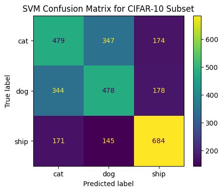

# CIFAR-10 SVM Image Classifier

## Problem Statement

Can a classical support vector machine distinguish cats, dogs, and ships using only flattened grayscale pixel values? In this project, I establish a classical machine-learning baseline and examine where that representation succeeds and fails.

## Approach

1. I loaded CIFAR-10 through `tensorflow.keras.datasets.cifar10`.
2. I selected the cat, dog, and ship classes.
3. I converted 32 by 32 RGB images to grayscale with luminance weighting.
4. I normalized intensities from 0-255 to 0-1.
5. I flattened every image into a 1,024-feature vector.
6. I trained a scikit-learn `SVC` with a linear kernel.
7. I evaluated 3,000 held-out images with accuracy, per-class metrics, a confusion matrix, and sample predictions.

My final data split contains 15,000 training images and 3,000 test images, balanced across the three selected classes.

## Results

| Metric | Result |
| --- | ---: |
| Test accuracy | 54.7% |
| Macro precision | 54% |
| Macro recall | 55% |
| Macro F1-score | 55% |
| Cat recall | 48% |
| Dog recall | 48% |
| Ship recall | 68% |

I found that ships were the easiest class: my model correctly identified 684 of 1,000. My largest errors were between visually similar animal classes, with 347 cats predicted as dogs and 344 dogs predicted as cats.



## Key Findings

- My 54.7% accuracy exceeds the approximately 33.3% balanced-class chance baseline, so I confirmed that flattened pixels contain useful signal.
- I found that grayscale conversion and flattening reduce complexity but remove color and spatial relationships.
- I found the confusion matrix more informative than accuracy alone because it revealed my model's asymmetric strengths.
- I concluded that convolutional neural networks are better suited to learning local spatial features from images.

## Technologies Used

- Python
- NumPy
- TensorFlow/Keras for CIFAR-10 loading
- Scikit-learn for SVM training and evaluation
- Matplotlib
- Google Colab/Jupyter

## Dataset

I used the public [CIFAR-10 dataset](https://www.cs.toronto.edu/~kriz/cifar.html). I do not store the dataset in this repository; I download it automatically with:

```python
from tensorflow.keras.datasets import cifar10
(X_train, y_train), (X_test, y_test) = cifar10.load_data()
```

## How to Run

### Google Colab

To reproduce my Colab run:

1. Open [`CIFAR10_SVM_Classifier.ipynb`](CIFAR10_SVM_Classifier.ipynb) in Colab.
2. Select **Runtime > Run all**.
3. Allow time for the roughly 170 MB CIFAR-10 download and linear SVM training.

### Local Jupyter

To reproduce my work locally:

```bash
python -m venv .venv
python -m pip install -r requirements.txt
jupyter notebook CIFAR10_SVM_Classifier.ipynb
```

An internet connection is required the first time CIFAR-10 is downloaded. SVM training on 15,000 samples can be slow without a high-performance CPU.

## Files

- [`CIFAR10_SVM_Classifier.ipynb`](CIFAR10_SVM_Classifier.ipynb) - executed source notebook
- [`results/`](results/) - preprocessing, confusion-matrix, and prediction images
- [`report/CIFAR10_SVM_Project_Report.pdf`](report/CIFAR10_SVM_Project_Report.pdf) - full project report
- [`requirements.txt`](requirements.txt) - Python dependencies

[Return to the ITAI 1378 overview](../../)
