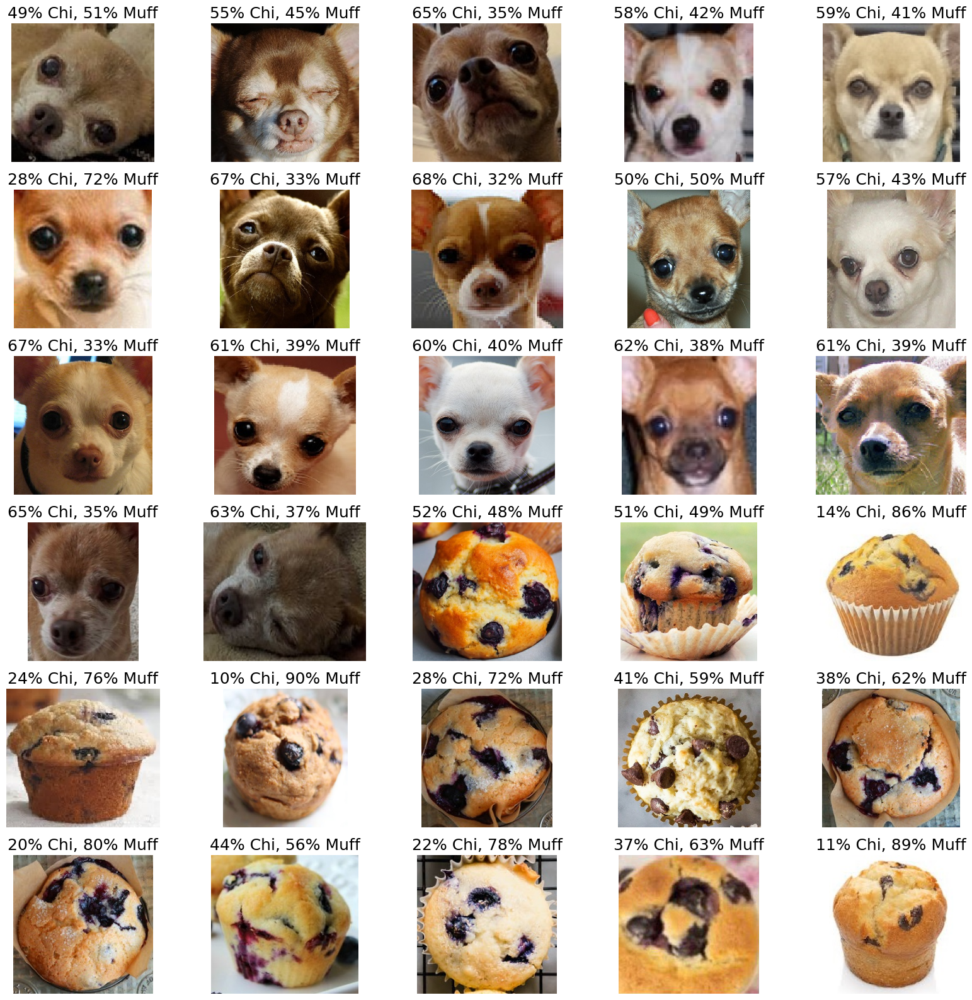

# Chihuahua or Muffin Neural Network

## Problem Statement

Chihuahuas and muffins can share similar colors and textures in small images. In this project, I build a two-class PyTorch neural network to explore the full training workflow and examine both accuracy and prediction confidence on visually ambiguous examples.

## Approach

1. I cloned the credited workshop repository to obtain the teaching notebook and image folders.
2. I resized RGB images to 64 by 64 pixels.
3. I converted images to tensors and normalized channels to approximately -1 to 1.
4. I loaded 120 training images and 30 validation images in batches of eight.
5. I flattened each image into 12,288 values.
6. I trained a multilayer perceptron with hidden layers of 128, 64, and 32 units.
7. I used ReLU activations, cross-entropy loss, and stochastic gradient descent with a learning rate of 0.1.
8. I trained for three epochs and inspected all validation predictions.

## Results

| Epoch | Training accuracy | Validation accuracy |
| ---: | ---: | ---: |
| 1 | 45.83% | 46.67% |
| 2 | 56.67% | 70.00% |
| 3 | 80.00% | 86.67% |

My final validation result corresponds to 26 correct predictions out of 30 images.

## Limitations

- I worked with a very small dataset: 120 training images and 30 validation images.
- I used one validation split and did not preserve a separate holdout test set.
- I did not fix a random seed, so a new run may produce different metrics.
- By flattening the images, I removed spatial structure. A convolutional neural network or transfer-learning model would be a stronger image architecture.
- I do not interpret my saved 86.67% result as a general benchmark.

## Key Findings

- I found that prediction probabilities reveal uncertainty that a single accuracy score hides.
- I observed how data transforms, batch size, learning rate, network depth, and epoch count influence training.
- I learned that small datasets make validation metrics sensitive to individual examples.
- I concluded that CNNs preserve local image structure and would likely generalize better than this multilayer perceptron.

## Technologies Used

- Python
- PyTorch and TorchVision
- Pillow
- Matplotlib
- tqdm
- Google Colab/Jupyter

## Dataset and Attribution

I used the staged Chihuahua/muffin image dataset from [patitimoner/workshop-chihuahua-vs-muffin](https://github.com/patitimoner/workshop-chihuahua-vs-muffin). I do not duplicate the data in this portfolio; my first notebook cell clones the source repository.

I credit the workshop structure and source material to the original repository. I completed the exercise's variable selections and explanatory comments, executed the training workflow, analyzed the saved results, and wrote the accompanying report.

## How to Run

To reproduce my run:

1. Start a fresh Google Colab runtime.
2. Open [`Chihuahua_Muffin_Classifier.ipynb`](Chihuahua_Muffin_Classifier.ipynb).
3. Select **Runtime > Run all**.
4. The first cell clones the source repository and changes into its directory.

A fresh runtime is recommended because rerunning the clone cell in an existing session can encounter an already-existing folder.

For local execution, install [`requirements.txt`](requirements.txt), ensure Git is available, and run the notebook from a directory where it can clone the workshop repository.

## Files

- [`Chihuahua_Muffin_Classifier.ipynb`](Chihuahua_Muffin_Classifier.ipynb) - executed source notebook
- [`results/`](results/) - dataset preview and saved validation predictions
- [`report/Chihuahua_Muffin_Project_Report.pdf`](report/Chihuahua_Muffin_Project_Report.pdf) - full project report
- [`requirements.txt`](requirements.txt) - Python dependencies

[Return to the ITAI 1378 overview](../../)
