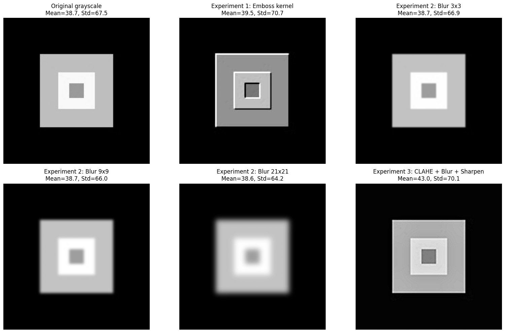

# L02: Image Processing Fundamentals

## Problem Statement

How do common image-processing operations change the numerical and visual properties of an image? In this project, I make the pixel-level mechanics visible and compare point operations, neighborhood filters, global enhancement, and geometric transformations.

## Approach

I created a reproducible 200 by 200 RGB test image and then:

1. I inspected shape, data type, pixel range, and memory use.
2. I separated RGB channels and compared their statistics.
3. I implemented three grayscale-conversion methods.
4. I applied brightness and contrast point operations.
5. I used convolution kernels for blur, edge detection, sharpening, and embossing.
6. I compared histogram equalization and CLAHE.
7. I applied scaling, rotation, translation, perspective, and shearing.
8. I combined operations into artistic effects and a document-style cleanup pipeline.
9. I quantified mean intensity, intensity standard deviation, and edge density.

## Results

My saved notebook contains 11 visual outputs and no saved error tracebacks. On my generated sample image:

| Experiment | Standard deviation | Edge density |
| --- | ---: | ---: |
| Original grayscale | 67.50 | 0.0167 |
| Custom emboss filter | 70.73 | 0.0263 |
| Gaussian blur, 21 x 21 | 64.19 | 0.0052 |
| CLAHE + smoothing + sharpening | 70.09 | 0.0312 |

These values apply only to the notebook's generated test image. They show the expected direction of change: strong blur removes detectable edges, while embossing and cleanup/sharpening emphasize local intensity transitions.



## Key Findings

- I confirmed that a color image is a three-dimensional numerical array; grayscale reduced my sample from 120,000 bytes to 40,000 bytes.
- I observed that point operations modify pixels independently, while convolution uses each pixel's neighborhood.
- I found that filter size and operation order materially affect retained detail.
- I learned that traditional preprocessing can make downstream computer-vision inputs more consistent, but aggressive enhancement can also remove or distort information.

## Technologies Used

- Python
- NumPy
- OpenCV
- Pillow
- Matplotlib
- Google Colab/Jupyter

## Dataset

I did not commit or require an external dataset. My notebook generates its own labeled test image at runtime and saves it as `test_image.jpg` in the notebook session.

## How to Run

### Google Colab

To reproduce my Colab run:

1. Open [`L02_Image_Processing_Fundamentals.ipynb`](L02_Image_Processing_Fundamentals.ipynb) in Google Colab.
2. Select **Runtime > Run all**.
3. The setup cell installs the required packages, and the next cell creates the sample image.

### Local Jupyter

To reproduce my work locally:

```bash
python -m venv .venv
python -m pip install -r requirements.txt
jupyter notebook L02_Image_Processing_Fundamentals.ipynb
```

Run cells from top to bottom so later operations receive the generated image and variables.

## Files

- [`L02_Image_Processing_Fundamentals.ipynb`](L02_Image_Processing_Fundamentals.ipynb) - executed source notebook
- [`results/`](results/) - selected standalone notebook outputs
- [`report/L02_Image_Processing_Fundamentals_Reflection.pdf`](report/L02_Image_Processing_Fundamentals_Reflection.pdf) - written reflection
- [`requirements.txt`](requirements.txt) - Python dependencies

[Return to the ITAI 1378 overview](../../)
