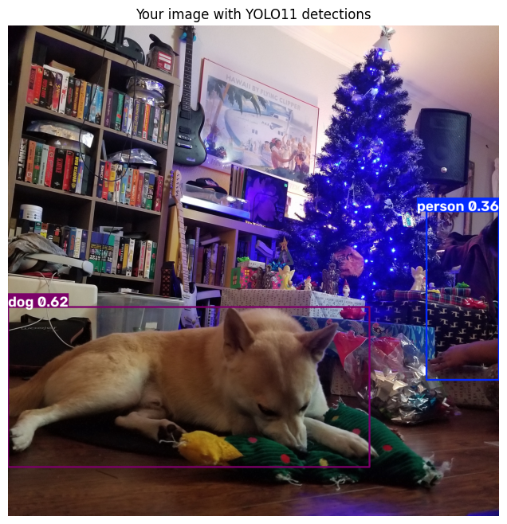
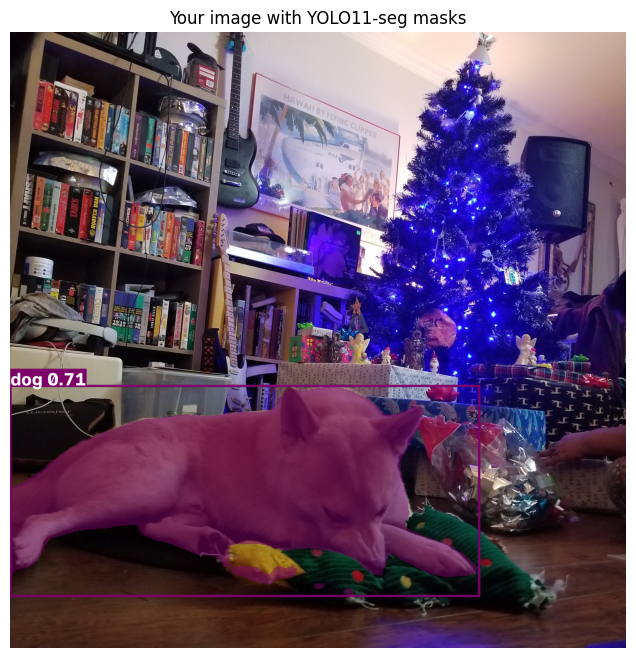

# L06 Object Detection using Transfer learning

## Problem Statement

How do modern object-detection and instance-segmentation models behave on both a standard benchmark-style image and a complex original photograph? In this lab, I compare bounding boxes, pixel masks, confidence thresholds, and a YOLO11-to-SAM 2 pipeline while examining what the pretrained models detect and miss.

## Approach

1. I ran pretrained YOLO11 nano on the Ultralytics bus sample and read its class labels, confidence scores, and box coordinates.
2. I compared confidence thresholds of 0.10, 0.25, and 0.70.
3. I used an original photograph I took for my custom detection and segmentation trials.
4. I ran YOLO11-seg to compare instance masks with detection boxes and inspected an individual mask.
5. I passed YOLO11 boxes to SAM 2 as prompts for a detect-then-segment pipeline.
6. I interpreted IoU, precision, recall, mAP, and specialist-versus-foundation-model trade-offs.
7. I connected the techniques to my LabRack Vision QA project direction.

## Results

| Experiment | Saved result |
| --- | --- |
| Sample-image thresholds | 6 detections at 0.10, 5 at 0.25, and 4 at 0.70 |
| Original-photo detection | Dog at 62% confidence and partially visible person at 36% |
| Original-photo segmentation | One dog mask at 71% confidence |
| SAM 2 pipeline | Generated masks from the YOLO11 sample-image boxes |

YOLO11 correctly detected the large foreground dog and the partially visible person in my original photograph, but it missed the guitars, books, speaker, tree, and presents. The segmentation model created a substantially tighter dog outline, especially around the body and open space below it, while still missing the remaining scene objects.

## Key Findings

- I observed that increasing the confidence threshold reduced the sample detections from six to four.
- I found that a correct, high-quality mask does not guarantee high recall across a crowded scene.
- I learned that YOLO provides fixed category labels, while SAM 2 needs prompts and returns geometry without semantic class names.
- I found that a detect-then-segment pipeline can combine YOLO's labels and localization with SAM 2's flexible masks.
- I concluded that application risk should determine whether I favor precision, recall, boxes, or masks.

## Technologies Used

- Python
- Ultralytics YOLO11 and YOLO11-seg
- Meta SAM 2 through Ultralytics
- PyTorch
- Matplotlib
- Pillow
- NumPy
- Google Colab/Jupyter

## Image and Model Sources

I took the original room photograph used for my custom trials. I used the public Ultralytics bus sample for the guided demonstration and pretrained `yolo11n.pt`, `yolo11n-seg.pt`, and `sam2.1_s.pt` weights downloaded by the notebook. I do not commit model weights or the separate source photograph to this repository; the executed notebook retains the visible outputs from my run.

## How to Run

1. Open [`L06_Leemann_Kate_ITAI1378.ipynb`](L06_Leemann_Kate_ITAI1378.ipynb) in Google Colab.
2. Upload the original image as `6407.JPG` into the Colab session.
3. Select **Runtime > Run all**.
4. Allow the setup and model cells to download the required packages and pretrained weights.

The submitted notebook has already been executed from top to bottom and retains its outputs. A new run requires internet access and the original photograph.

## Files

- [`L06_Leemann_Kate_ITAI1378.ipynb`](L06_Leemann_Kate_ITAI1378.ipynb) - completed, executed lab with all ten reflection answers
- [`results/`](results/) - selected detection, segmentation, SAM 2, threshold, and IoU outputs
- [`requirements.txt`](requirements.txt) - Python dependencies

[Return to the ITAI 1378 overview](../../)
